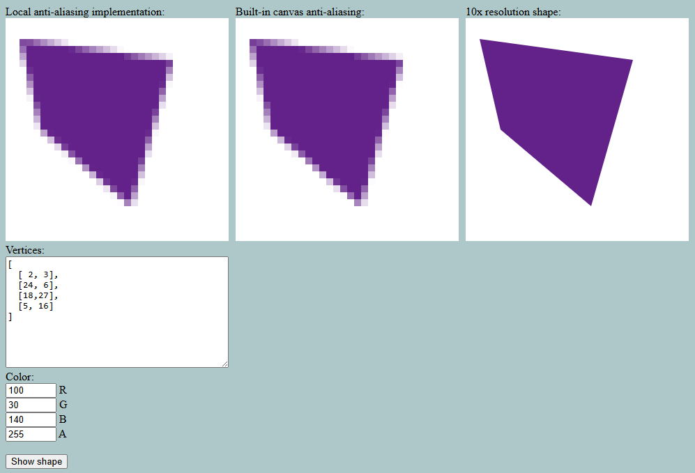

### What is this?

A small site to test out a local implementation of anti-aliasing.

Allows the user to specify a polygon within a 32x32 grid by supplying a list of vertices,
then renders it within that grid using anti-aliasing to smooth diagonal edges.

Includes two more canvases for comparison: the built-in browser anti-aliasing implementation,
as well as a high-resolution rendering of the polygon.

### How does it work?

For each pixel in a 32x32 grid, computes the percentage of that pixel's square which would
be occupied by the polygon if diagonals were possible, then renders the pixel with transparency
set to that value.

### Screenshots

### Acknowledgments
The [polybooljs](https://github.com/velipso/polybooljs) library is used for computing intersections
between polygons.
